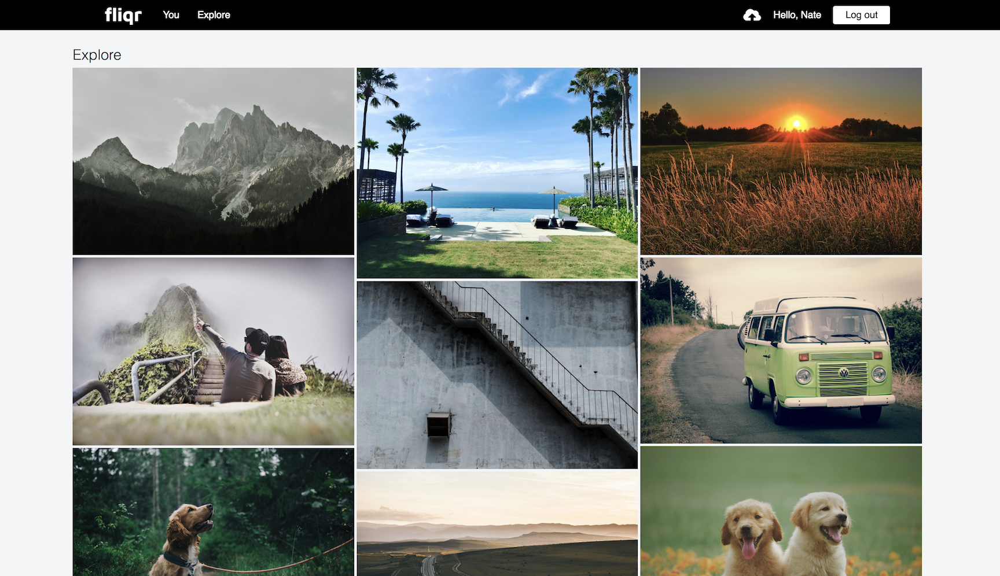
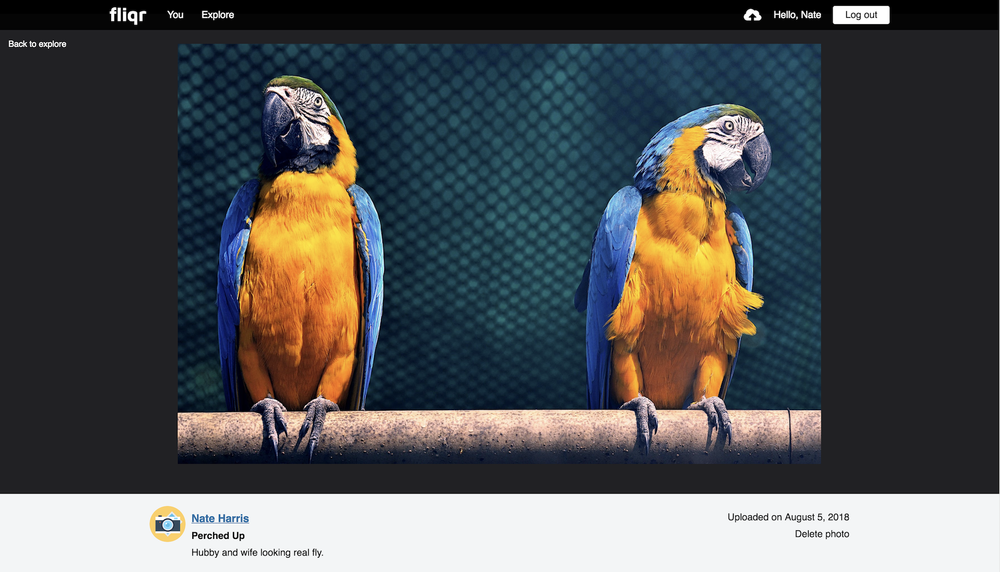
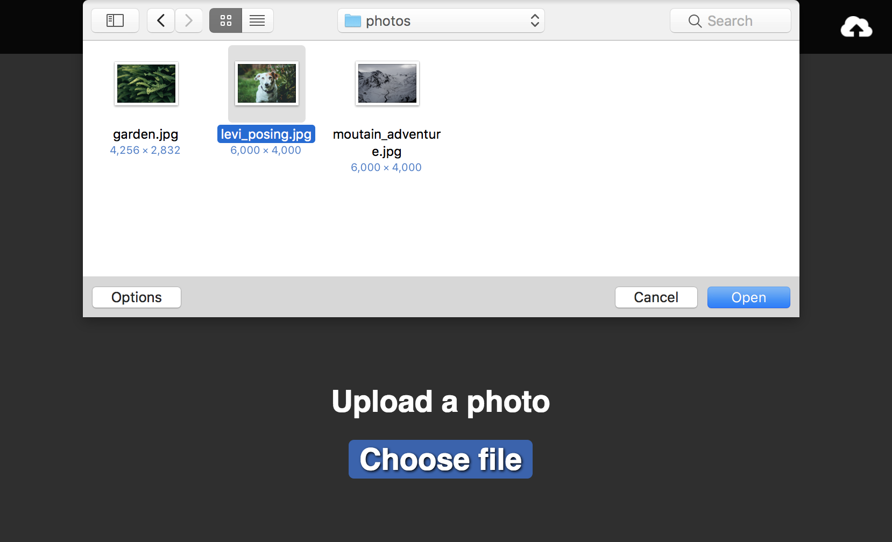
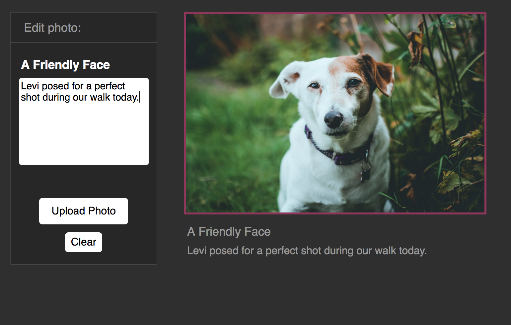
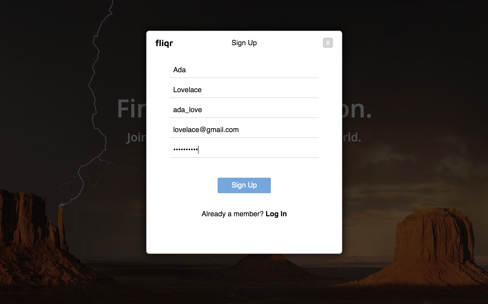

# fliqr


[Live site](https://fliqr.herokuapp.com/)

Fliqr is a photo-based web application built to clone the features and design of [Flickr](https://www.flickr.com). Photographs can be uploaded and viewed by other users. Fliqr was created with a Ruby on Rails backend, using a PostgreSQL database. A React/Redux architecture completes the frontend experience. Photos are stored by implementing Rails Active Storage alongside Amazon's S3. The application has several pending features and improvements.


# Features

## Photos
Fliqr's core is based on photo sharing. Various pages are needed to implement this fundamental element.

### Explore


Once logged in, members can access the feed page. Photos from users across the application platform are displayed in a scrollable, grid layout.


### Photo Viewing


The photo view page allow a member to view a specific photo. The footer will show the photographer's name along with the photo's information. If the photo belongs to the current user, a link to delete the photo will be rendered.

### Photo Uploading


For uploading, a user is first taken to an initial upload page for file selection. Once a file is chosen, the upload form is rendered. This is accomplished using simple conditional logic. If the file exists in the app state, render the form along with the photo preview:

```js
render() {
  return (this.state.photoUrl) ? (
    this.uploadForm()
  ) : (
    this.photoSelect()
  );
}
```



The upload form allows the user to add a title and optional description to the photo. The clear button nullifies the current photo's state, causing the photo selection page to be re-rendered.


## User Authentication


Member's must sign up and be logged in to access the site's features.

### Technologies
- React/Redux
- Ruby on Rails
- PostgreSQL
- Active Storage / Amazon S3

### Future Features
- User Profiles
- Albums
- Comments
- Tags
- Likes
- Follows
